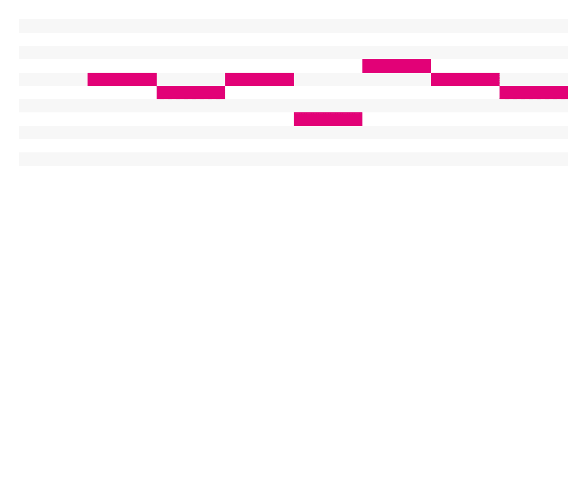
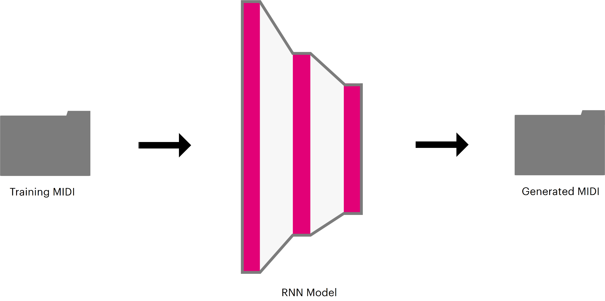

# MIDI-Music-generator

Generador de canciones monofónicas utilizando LSTM RNN en Keras

## Introducción

Este proyecto de redes recurrentes surgió en la clase de redes neuronales del profesor Julio Waissman, donde nos sugirió que buscaramos proyectos que nos llamaran la atención del tema, entonces decidí buscar en github proyectos hechos con redes recurrente y al final me decante por este.

## Experiencia

Lo primero que realice antes de entrenar la red, fue conseguir los archivos que necesitaba, en este caso fueron archivos MIDI donde fue fácil encontrar sitios con musica en ese formato, dejare los enlaces mas abajo. Lo segundo fue elegir la configuración de la red que usaría para entrenar, donde al final despues de probar varias combinaciones elegí 2 capas de LSTM con 64 neuronas cada una, con una capa densa de 128 al final utilizando un dropout de 35%. Durante el entrenamiento surgieron varios problemas como el hecho de que algunos archivos midi venían corrompidos o entender bien las opciones de configuración del proyecto ya que si no estaba con buenas configuraciones el entrenamiento tardaba mas tiempo en entrenar. Por ultimo, en el proceso de generación de canciones probé varios conjuntos de videojuegos como pokemon, donde separe conjuntos de archivos MIDI por el tono que tenían, también probé con musica de anime. Los resultados los dejare abajo. En general despues de 

## ¿Cómo funciona?

El generador funciona así, toma una carpeta con una lista de canciones MIDI, cada canción es verificada si es monofónica, si no es el caso las descarta. Luego desglosa las canciones restantes en una serie de ventanas con un ancho fijo que representan la canción como secciones de eventos de notas con una duración de 16 notas. Cada ventana X, contiene n eventos donde n es el tamaño de la ventana. Cada colección de evento X esta emparejado con el valor del evento n+1 que sera y. El valor de y es la nota que sigue en la secuencia de notas en la canción. Se desliza la ventana a través de cada una de las canciones, recolectando pares X y Y para crear el conjunto de datos que se usara para entrenar.



MIDI es una representación estándar para grabar y almacenar información sobre eventos musicales. Simboliza todas las notas musicales (occidentales) C-2 - G8, como uno de los 128 valores (0-127). Para usarlos como entrada para el generador, transformamos cada nota de este formato en una codificación conocida como "one-hot" antes de incluirla en nuestro modelo a entrenar. La codificación representa los datos como una representación binaria con una profundidad de bits igual al número de clases, en nuestro caso 129, donde todos los valores de bits se establecen en cero excepto el índice de la categoría representada por la codificación, que se establece en uno.

Antes de entrenar el modelo, debemos de dividir el conjunto de datos en dos grupos, entrenamiento y validación. El conjunto de entrenamiento se usa para entrenar el modelo, mientras que los de validación se guardan y se usan para evaluar el desempeño del modelo en canciones que no se han visto. Los conjuntos de datos fueron separados en 80% en entrenamiento y 20% de validación el cual es una buena división.

El modelo se entrena mediante la alimentación iterativa de los datos de entrada X y el cálculo del resultado de la capa de salida. Pasamos los valores de la capa de salida sobre una función softmax, lo que resulta en probabilidades de que cada clase (0-128) sea el siguiente evento en la secuencia de eventos que se proporcionó la entrada X. Como tenemos el valor de salida y sabemos cuál es el verdadero valor del próximo evento, podemos comparar la predicción de nuestro modelo con la clase del evento real de nuestra secuencia MIDI, entonces podemos cuantificar qué tan correcta/incorrecta es la predicción de nuestro modelo en cada paso de entrenamiento y actualizar nuestro modelo para minimizar nuestro error de predicción.

Una vez que hemos entrenado el modelo, guardamos el modelo y lo utilizamos para generar nuevas canciones. Comenzamos la generación alimentando el modelo con una ventana X desde una canción existente. Esta entrada se denomina semilla y se usara para iniciar nuestro proceso de generación de secuencias. Con la ventana X se generara la primera nota nueva y la ventana se ira recorriendo de tal manera que se irán generando nuevas notas hasta el punto donde la secuencia de notas sea completamente generada por el modelo.



## Resultados


## Requisitos

Para poder ejecutar necesitas tener instaladas las siguientes librerías:

```bash
> pip install tensorflow
> pip install keras  
> pip install pretty-midi
``` 

## Obtención de canciones MIDI

Para musica de videojuegos encontré la siguiente pagina que es [khinsider](https://www.khinsider.com) donde tiene una sección de musica MIDI de videojuegos el cual es [esta](https://www.khinsider.com/midi). Cuenta con musica de videojuegos de consolas como gameboy, N64, Atari, Playstation, etc.

Para musica de anime me encontré un post en reddit donde encontré las paginas de [ichigos](https://ichigos.com/sheets) y de [josh's anime](http://josh.agarrado.net/music/anime/index.php), en estas encontré una gran cantidad de canciones de varios animes diferentes.

## Entrenamiento

Primero creamos un carpeta con archivos MIDI que te gustaría entrenar, por ejemplo en la ruta [./data/midi](./data/midi). Una vez que hecho esto utilizar las siguientes comandos:

```bash
python train.py --data_dir data/midi
```

Esto utilizara las funciones predeterminadas y entrenara con las canciones de la ruta dada. Para mas configuraciones ir a la sección de comandos.

## Generación de canciones MIDI

Una vez entrenado el modelo, ya puedes generar canciones.

```bash
python sample.py
```

De manera predeterminada esto creara 10 archivos MIDI utilizando el ultimo checkpoint del modelo entrenado, en la ruta [experiments](experiments/) se generaran los archivos MIDI en la carpeta de generated. Para mas configuraciones ir a la sección de comandos. 

## Comandos

### `train.py`

```
usage: train.py [-h] [--data_dir DATA_DIR] [--experiment_dir EXPERIMENT_DIR]
                [--rnn_size RNN_SIZE] [--num_layers NUM_LAYERS]
                [--learning_rate LEARNING_RATE] [--window_size WINDOW_SIZE]
                [--batch_size BATCH_SIZE] [--num_epochs NUM_EPOCHS]
                [--dropout DROPOUT]
                [--optimizer {sgd,rmsprop,adagrad,adadelta,adam,adamax,nadam}]
                [--grad_clip GRAD_CLIP] [--message MESSAGE] [--n_jobs N_JOBS]
                [--max_files_in_ram MAX_FILES_IN_RAM]

optional arguments:
  -h, --help            mostrar este mensaje de ayuda y salir.
  --data_dir DATA_DIR   Directorio de datos que contiene archivos .midi 
                        para usar en el entrenamiento (predeterminado: data/midi)
  --experiment_dir EXPERIMENT_DIR
                        El directorio para almacenar los puntos de control y los 
                        registros de tensorboard. Si se omite, creará una nueva carpeta 
                        numerada en experimentos /. (predeterminado: experiments/default)
  --rnn_size RNN_SIZE   Número de neuronas por capa oculta de RNN (default: 64)
  --num_layers NUM_LAYERS
                        Número de capas en RNN (predeterminado: 1)
  --learning_rate LEARNING_RATE
                        Tasa de aprendizaje. Si no se especifica, se utiliza la velocidad 
                        de aprendizaje recomendada para el optimizador elegido.
                        (predeterminado: None)
  --window_size WINDOW_SIZE
                        Tamaño de la ventana para la entrada de RNN por paso. (predeterminado: 20)
  --batch_size BATCH_SIZE
                        Tamaño del minibatch (predeterminado: 32)
  --num_epochs NUM_EPOCHS
                        Número de epochs antes de parar de entrenar. (predeterminado: 10)
  --dropout DROPOUT     Porcentaje de pesos que se desactivan en cada paso del 
                        conjunto de entrenamiento. Esta es una regularización popular que 
                        puede ayudar con el sobreajuste. Los valores recomendados 
                        son 0.2-0.5 (predeterminado: 0.2)
  --optimizer {sgd,rmsprop,adagrad,adadelta,adam,adamax,nadam}
                        El algoritmo de optimización a utilizar. Consulte https://keras.io/optimizers 
                        para obtener una lista completa de optimizadores. (predeterminado: adam)
  --n_jobs N_JOBS, -j N_JOBS
                        Número de CPU que se utilizarán al cargar y analizar 
                        archivos midi. (predeterminado: 1)
  --max_files_in_ram MAX_FILES_IN_RAM
                        El número máximo de archivos midi para cargar en la 
                        memoria RAM a la vez. Un valor más alto entrena más rápido 
                        pero usa más RAM. Un valor más bajo utiliza menos RAM, pero lleva 
                        mucho más tiempo entrenar. (predeterminado: 25)
```

### `sample.py`


```
usage: sample.py [-h] [--experiment_dir EXPERIMENT_DIR] [--save_dir SAVE_DIR]
                 [--midi_instrument MIDI_INSTRUMENT] [--num_files NUM_FILES]
                 [--file_length FILE_LENGTH] [--prime_file PRIME_FILE]
                 [--data_dir DATA_DIR]

optional arguments:
  -h, --help            mostrar este mensaje de ayuda y salir.
  --experiment_dir EXPERIMENT_DIR
                        Directorio para cargar el modelo guardado. 
                        Si se omite, utilizará el directorio más reciente de los experiments /.
                        (predeterminado: experiments/default)
  --save_dir SAVE_DIR   Directorio para guardar archivos generados El directorio se creará 
                        si no existe. Si no se especifica, los archivos se guardarán en generated / dentro de --experiment_dir. (predeterminado: None)
  --midi_instrument MIDI_INSTRUMENT
                        Nombre del instrumento MIDI (o número) a usar para los archivos generados. 
                        Consulte
                        https://www.midi.org/specifications/item/gm-level-1
                        -sound-set para obtener una lista completa de los nombres de los instrumentos.
                        (predeterminado: Acoustic Grand Piano)
  --num_files NUM_FILES
                        Número de archivos midi a generar (predeterminado: 10)
  --file_length FILE_LENGTH
                        Longitud de cada archivo, medida en 16 notas. (predeterminado:
                        1000)
  --prime_file PRIME_FILE
                        Primeros archivos generados de archivos midi. Si no se especificaron, 
                        se usarán ventanas aleatorias del conjunto de datos de validación para la siembra. (predeterminado: None)
  --data_dir DATA_DIR   Directorio de datos que contiene archivos .mid para usar 
                        forseeding / priming. Requerido si no se especifica 
                        --prime_file (predeterminado: data/midi)

```